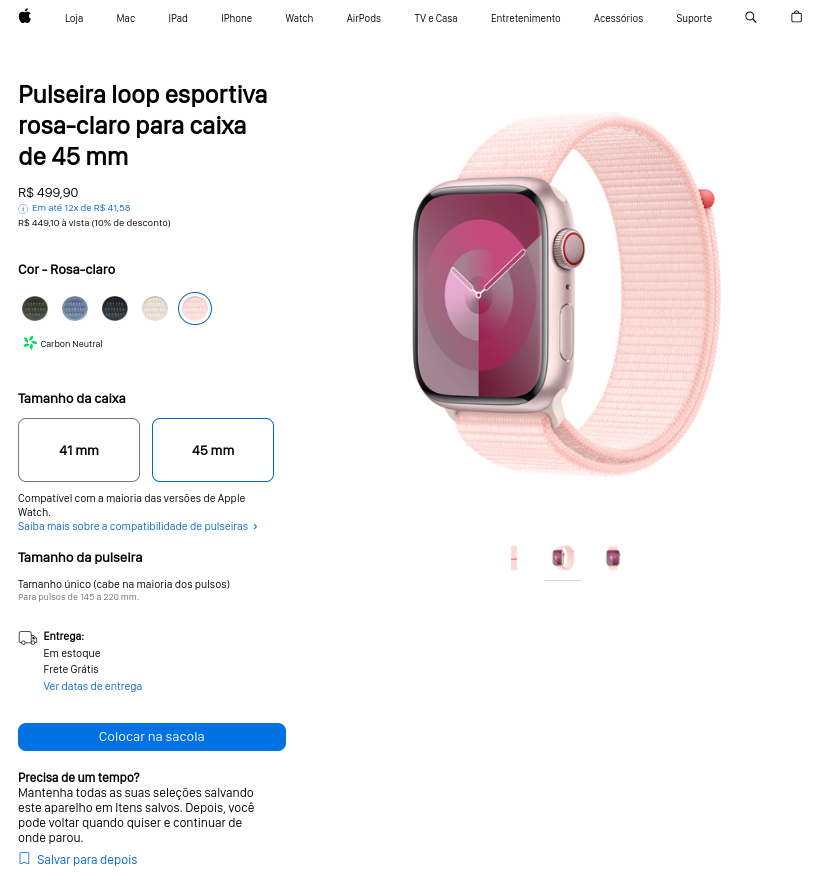

# Hashtag Watch

Este é um clone da página de produto do Apple Watch, desenvolvido com HTML, CSS e JavaScript.

## Funcionalidades

- **Seleção de Cor e Tamanho:** Os usuários podem escolher entre diferentes opções de cores e tamanhos para a pulseira do Apple Watch.
- **Visualização em Tempo Real:** A seleção da cor e do tamanho é refletida instantaneamente na visualização do produto.
- **Informações Detalhadas:** Informações sobre preço, disponibilidade, entrega e opções de pagamento são exibidas de forma clara e concisa.

## Créditos

Este projeto foi inspirado na página de produto do Apple Watch e foi criado como parte de um exercício de desenvolvimento web fornecido pela Hashtag Treinamentos.

Imagem de <a href="https://br.freepik.com/vetores-gratis/rastreador-de-fitness-de-design-plano_8252726.htm#query=apple%20watch%20cute%20illustration&position=13&from_view=search&track=ais&uuid=27cc2a50-571a-4900-a9de-df3f5c16ac47">Freepik</a>

##

